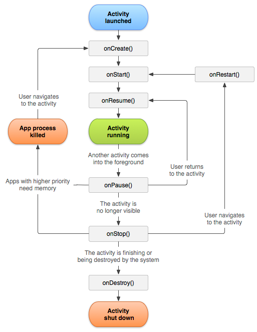

# AndoirdLifeCycle
### 안드로이드 생명주기 

## 어플리케이션 로딩 후 MainActivity 시작 생명주기
1. onCreate
2. onStart
3. onResume

## 어플리케이션 Main -> Second Activity 로 넘어갈 때 전체 생명주기

|MainActivity|SecondActivity|
|---|---|
|1. onPause ||
|| 2. onCreate|
|| 3. onStart|
|| 4. onResume|
|5. onStop ||

## 어플리케이션 Second -> Main Activity 로 넘어갈 때 전체 생명주기

|MainActivity|SecondActivity|
|---|---|
||1. onPause|
|2. onRestart||
|3. onStart||
|4. onResume||
||5. onStop|
||6. onDestroy|
